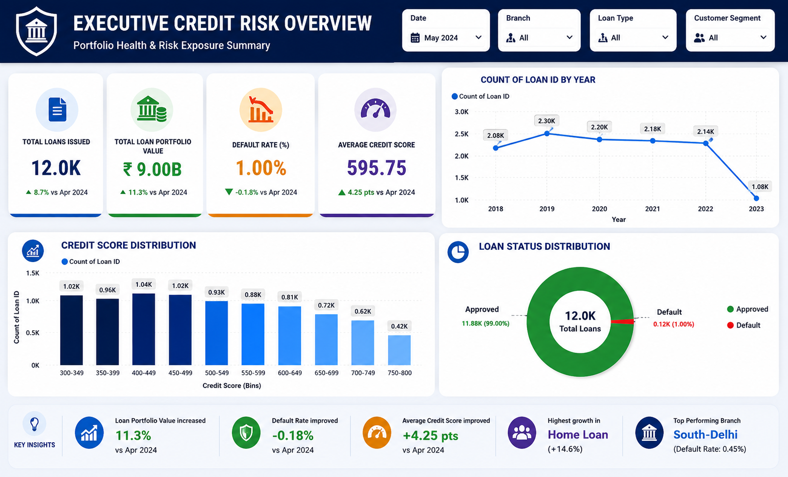
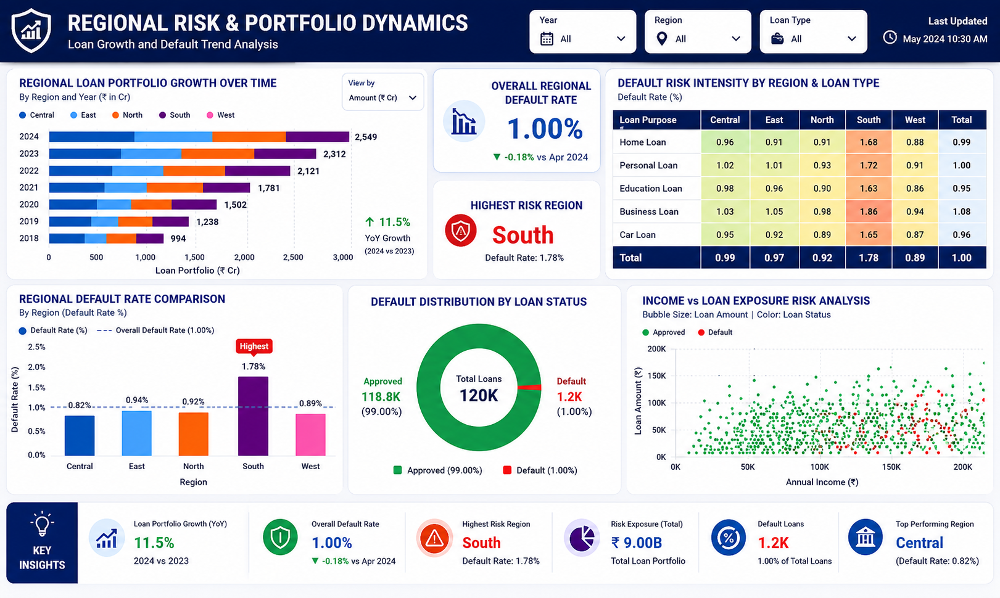
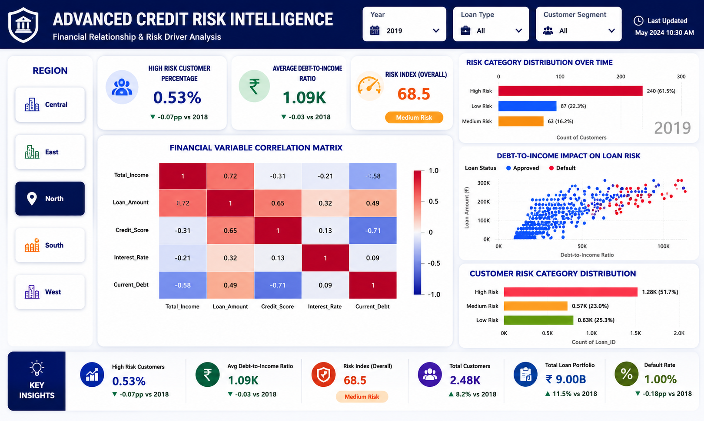
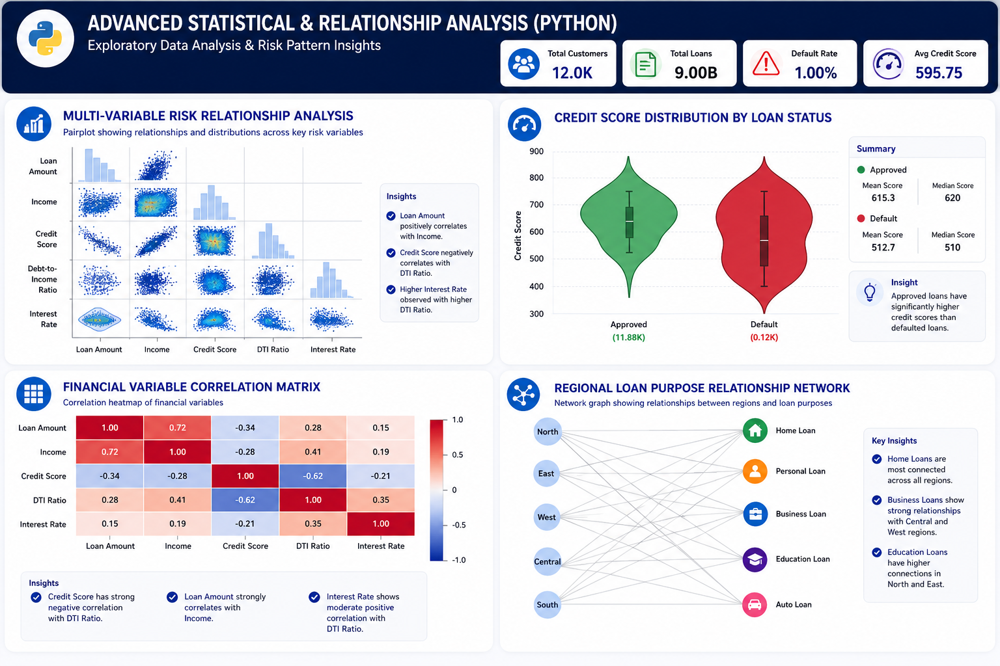

# 📊 Enterprise Credit Risk Analysis & Financial Health Analytics Platform

An end-to-end **Credit Risk Analytics** solution that integrates **SQL, Power Query, Python, Power BI, and DAX** to transform raw banking loan data into actionable business insights. The project simulates a real-world banking analytics solution by combining ETL, financial KPI development, statistical analysis, and executive dashboards to monitor portfolio health, identify default risks, and support strategic lending decisions.

---

# 📌 Project Overview

Financial institutions continuously monitor loan portfolios to minimize credit risk while maximizing profitability. This project analyzes **12,000+ banking loan records** with **22 financial attributes** to evaluate portfolio performance, identify high-risk borrowers, analyze financial health indicators, and generate executive-level insights through interactive dashboards.

The project covers the complete analytics lifecycle:

- ETL using Power Query & SQL
- Data Transformation & Feature Engineering
- Statistical Analysis using Python
- KPI Development using DAX
- Executive Dashboard Development in Power BI

---

# 🎯 Business Problem

Banks must balance loan growth with risk exposure. High default rates directly impact profitability, making early identification of risky borrowers essential.

This project addresses the following business questions:

- Which customers are most likely to default?
- Which financial variables contribute most to credit risk?
- Which regions carry the highest portfolio exposure?
- Which loan products have the highest default rates?
- How can executives monitor portfolio health through interactive dashboards?

---

# 🏦 Business Objectives

- Monitor overall loan portfolio performance
- Identify high-risk customers
- Measure borrower financial health
- Compare regional credit risk
- Evaluate loan default trends
- Analyze financial relationships affecting loan performance
- Support data-driven lending decisions

---

# 🛠️ Tech Stack

| Technology | Purpose |
|------------|----------|
| **Power BI Desktop** | Dashboard Development |
| **Power Query (M Language)** | ETL Pipeline |
| **DAX** | KPI & Financial Calculations |
| **MySQL** | Data Cleaning & SQL Analysis |
| **Python** | Statistical Analysis |
| **Pandas** | Data Manipulation |
| **NumPy** | Numerical Analysis |
| **Matplotlib** | Data Visualization |
| **Seaborn** | Statistical Visualization |
| **NetworkX** | Relationship Analysis |
| **Git & GitHub** | Version Control |

---

# 🏗️ Project Architecture

```text
Raw Quarterly Loan CSV Files
            │
            ▼
Power Query ETL Pipeline
(Append, Clean, Transform)
            │
            ▼
SQL Data Cleaning
            │
            ▼
Feature Engineering
            │
            ▼
Python Exploratory Data Analysis
            │
            ▼
Power BI Data Modeling
            │
            ▼
DAX Measures
            │
            ▼
Executive Credit Risk Dashboard
```

---

# 📂 Dataset

**Domain:** Banking & Finance

**Records:** 12,000+

**Features:** 22

### Key Attributes

- Loan ID
- Customer ID
- Age
- Annual Income
- Credit Score
- Loan Amount
- Interest Rate
- Debt-to-Income Ratio
- Employment Length
- Loan Purpose
- Loan Status
- Region
- Risk Category

---

# 🔄 ETL Pipeline (Power Query)

## Phase 1 — Data Cleaning

- Appended quarterly CSV files using `Folder.Files()`
- Removed duplicate records
- Standardized customer names and categorical fields
- Handled NULL values using average imputation
- Cleaned Interest Rate formatting
- Fixed date locale
- Removed hidden spaces and invalid characters

---

## Phase 2 — Data Transformation

Created engineered features including:

- Quarter
- Month Name
- Month Number
- Year
- Loan Age (Days)
- EMI
- Risk Category
- Risk Score
- Loan Amount in Lakhs
- Bad Loan Flag

---

## Phase 3 — Analysis Preparation

Created summary tables:

- Region Summary
- Loan Type Summary
- Quarter Summary
- Status Summary
- Risk Summary

---

# 🧮 DAX Measures

Developed 20+ business KPIs including:

- Total Loans
- Portfolio Value
- Default Rate %
- Recovery Rate %
- Average Credit Score
- High Risk Customers
- Risk Exposure
- NPA Amount
- Loan Growth %
- Regional Portfolio

Example:

```DAX
Bad_Loan_Rate_% =
ROUND(
DIVIDE([Bad_Loan_Count],[Total_Loans],0)*100,
2
)
```

---

# 🧠 Python Statistical Analysis

Performed using:

- Pandas
- NumPy
- Matplotlib
- Seaborn
- NetworkX

Analysis includes:

- Exploratory Data Analysis (EDA)
- Pair Plot
- Violin Plot
- Correlation Matrix
- Distribution Analysis
- Network Graph
- Financial Variable Relationships

---

# 📊 Dashboard Structure

## 📄 Page 1 — Executive Credit Risk Overview

### KPI Cards

- Total Loans Issued
- Total Loan Portfolio Value
- Default Rate
- Average Credit Score

### Visualizations

- Loan Status Distribution
- Credit Score Distribution
- Loan Trend Analysis
- Executive KPI Cards

---

## 📄 Page 2 — Regional Risk & Portfolio Dynamics

### KPI Cards

- Regional Default Rate
- Highest Risk Region

### Visualizations

- Regional Loan Growth
- Regional Default Comparison
- Risk Heatmap
- Income vs Loan Exposure Analysis

---

## 📄 Page 3 — Advanced Credit Risk Intelligence

### KPI Cards

- High Risk Customer %
- Average Debt-to-Income Ratio
- Risk Index

### Visualizations

- Correlation Matrix
- Debt-to-Income Impact Analysis
- Risk Category Distribution
- Financial Relationship Analysis

---

## 📄 Page 4 — Advanced Statistical & Relationship Analysis (Python)

### Visualizations

- Pair Plot
- Violin Plot
- Correlation Heatmap
- Network Graph

---

# 📈 Key Performance Indicators

- Total Loans Issued
- Loan Portfolio Value
- Default Rate
- Recovery Rate
- Average Credit Score
- Risk Exposure
- High Risk Customers
- Debt-to-Income Ratio
- Regional Default Rate
- Loan Growth
- Portfolio Health Index

---

# 🔍 Key Business Insights

- Debt-to-Income Ratio is one of the strongest indicators of default risk.
- Lower credit scores are associated with significantly higher default probability.
- Regional portfolio exposure varies across different geographical locations.
- High-risk borrowers are concentrated within specific financial segments.
- Credit score distribution differs substantially between approved and defaulted loans.
- Financial variables demonstrate strong interrelationships affecting borrower behavior.

---

# 💡 Business Recommendations

- Strengthen lending policies for high-risk borrowers.
- Implement automated early-warning systems using Debt-to-Income Ratio.
- Monitor regional portfolio exposure monthly.
- Improve customer segmentation using financial health indicators.
- Deploy predictive machine learning models for proactive default prevention.
- Enhance executive reporting with automated KPI monitoring.

---

# 🚀 Future Enhancements

- Logistic Regression Default Prediction
- Random Forest Classifier
- XGBoost Model
- SHAP Explainability
- SQL Server Integration
- Power BI Service Deployment
- Azure Data Factory Pipeline
- Automated Executive Reports
- Real-Time Dashboard Refresh

---

# 📁 Project Structure

```text
Enterprise-Credit-Risk-Analytics/

│
├── Data/
│   ├── Loan_Data_Q1.csv
│   ├── Loan_Data_Q2.csv
│   ├── Loan_Data_Q3.csv
│   └── Master_Dataset.csv
│
├── SQL/
│   ├── Data_Cleaning.sql
│   ├── Feature_Engineering.sql
│   ├── Analysis.sql
│   └── Views.sql
│
├── Python/
│   ├── EDA.ipynb
│   ├── Statistical_Analysis.ipynb
│   ├── Correlation_Analysis.ipynb
│   └── Network_Analysis.ipynb
│
├── PowerBI/
│   └── Enterprise_Credit_Risk_Analytics.pbix
│
├── Screenshots/
│   ├── Executive_Overview.png
│   ├── Regional_Risk.png
│   ├── Credit_Intelligence.png
│   └── Python_Analysis.png
│
├── README.md
└── Dataset.csv
```

---

# 💼 Skills Demonstrated

## Data Engineering

- ETL Pipeline Design
- Data Cleaning
- Data Transformation
- Feature Engineering
- Data Modeling

## SQL

- Data Extraction
- Aggregations
- Joins
- Business Queries
- Data Preparation

## Power BI

- Dashboard Design
- DAX Development
- Power Query
- KPI Development
- Interactive Reporting
- Executive Dashboards

## Python

- Exploratory Data Analysis
- Statistical Analysis
- Correlation Analysis
- Data Visualization
- Network Analysis

## Business Intelligence

- Credit Risk Analytics
- Financial Health Assessment
- Loan Portfolio Analysis
- Risk Segmentation
- Executive Reporting
- Decision Support Analytics

---

# 📷 Dashboard Preview

## Executive Credit Risk Overview



---

## Regional Risk & Portfolio Dynamics



---

## Advanced Credit Risk Intelligence



---

## Advanced Statistical & Relationship Analysis



---

# ⭐ Project Highlights

- End-to-End Banking Analytics Solution
- Automated ETL Pipeline using Power Query
- SQL-Based Data Cleaning & Transformation
- Advanced Statistical Analysis using Python
- Interactive Executive Dashboards in Power BI
- 20+ Financial KPIs developed using DAX
- Multi-page Dashboard with Executive Reporting
- Business Recommendations based on Financial Risk Analysis

---

# ⭐ Key Takeaways

This project demonstrates an enterprise-grade **Credit Risk Analytics Platform** that transforms raw banking data into actionable business intelligence. It showcases the complete analytics lifecycle—from ETL and feature engineering to statistical analysis, financial KPI development, and executive dashboarding—highlighting practical skills in **SQL, Power Query, Python, DAX, and Power BI** for real-world banking and financial analytics use cases.

---

## 👨‍💻 Author

**Your Name**

**Role:** Data Analyst | Business Intelligence Analyst

- 📧 Email: nusratdataanalyst@gmail.com
- 💼 LinkedIn: https://linkedin.com/in/NusratGulbarga
- 💻 GitHub: https://github.com/NusratGulbarga

---

⭐ **If you found this project useful, consider giving it a Star!**
